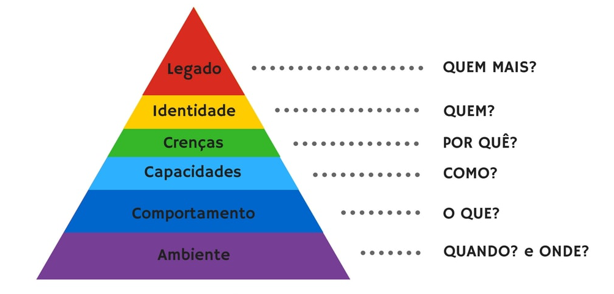

Nossa gente! Mais de 1500 acessos no meu primeiro texto! Isso foi o mais próximo de _viralizar_ que já cheguei 😊

Continuando com a temática de **transição**, separei um texto que escrevi em dezembro de 2017 (quase um ano atrás!).

Em Agosto de 2017, depois de 2 anos de terapia eu finalmente entendi o que melhor me definia e já tinha confiança e coragem que sustentavam minha ansiedade para dar inicio ao meu processo de transição.

Então o texto abaixo foi escrito após 2 meses do início do tratamento hormonal… A cabeça estava a mil, e o corpo iniciando sua metamorfose.

## A Biblioteca

Um dos primeiros conceitos que me impactou nos vários treinamentos de PNL que assisti foi a Hierarquia de Níveis Neurológicos:

O nível que mais chamou minha atenção foi o da identidade - o conjunto de características que caracterizam quem nós somos. Normalmente estas características estão associadas às frases que usamos para nos definir: _sou pontual_, _sou honesto(a)_, _sou exigente_, etc.

Hoje fazendo minha caminhada matinal pensei numa metáfora para a minha identidade.

Imaginei meu conjunto de características que me definem como se fosse uma grande Biblioteca. Cheia de salas e cada sala cheia de livros.

Porém uma destas salas se destacava das outras.

Enquanto nas outras salas eu tinha livre acesso, tanto para andar entre elas quanto para mostrá-las as pessoas que eu conheço, essa outra sala tinha uma atmosfera diferente.

Nos meus primeiros anos de vida, por observação, percebi que esta sala era especial. Eu não conseguia identificar ninguém no meu convívio que possuísse uma sala como a minha.

Com o passar dos anos, fui percebendo que as pessoas tendiam a se agrupar em tribos que possuíam conteúdos parecidos nas suas salas.

Percebi também que algumas pessoas não se importavam, mas uma parte bem barulhenta não admitia a existência nem tolerava a convivência com quem possuía uma sala diferente das delas próprias.

Achei então a solução _perfeita_: nunca iria chegar perto desta porta! “Deixa essa sala pra lá... Nunca abri essa porta, não sei nem qual é o nome que está escrito na sua placa” pensava. E o tempo foi passando.

E os anos passando.

E a vida passando.

Mas essa porta era a única que eu nunca tinha aberto nem levado ninguém lá... Ela ficava me chamando o tempo todo. Quanto menos eu queria pensar nela mais eu pensava. Como uma bola de neve...

Então um dia, depois de muito ler sobre o assunto pelo menos consegui chegar perto o suficiente pra conseguir ler o que estava escrito em sua placa: “Identidade de Gênero”.

Resolvi então procurar ajuda de alguém que pudesse caminhar comigo nesta biblioteca e tivesse a paciência e força de vontade de me pegar pela mão e me acompanhar nessa jornada.

Por mais ferramentas que eu possuísse, não tinha condições de fazer essa exploração por conta própria…

A nebulosidade da porta foi perdendo força. Fui tendo mais coragem de chegar perto dela e finalmente um dia entrei nesta sala...

Ela estava uma bagunça... Só de escrever sobre ela as lágrimas já me correm pelo rosto.

Mas a minha guia permaneceu do meu lado, me ajudando a arrumar esta sala e perceber que ali dentro estavam guardadas emoções poderosíssimas e que me fazem tão bem.

E agora que esta sala começou a ser arrumada, que eu perdi o medo - medo de chegar perto, medo de entrar nela, medo de falar sobre ela, medo de alguém perceber que ela existia - eu passei a compartilhá-la com algumas pessoas queridas.

E todas estão adorando ver esta sala! Algumas percebem minha mudança, minha alegria, euforia de finalmente estar podendo ser completa na questão da minha identidade.

Mal posso esperar pelo que o futuro me reserva!!!

😘😘,

  = M =

