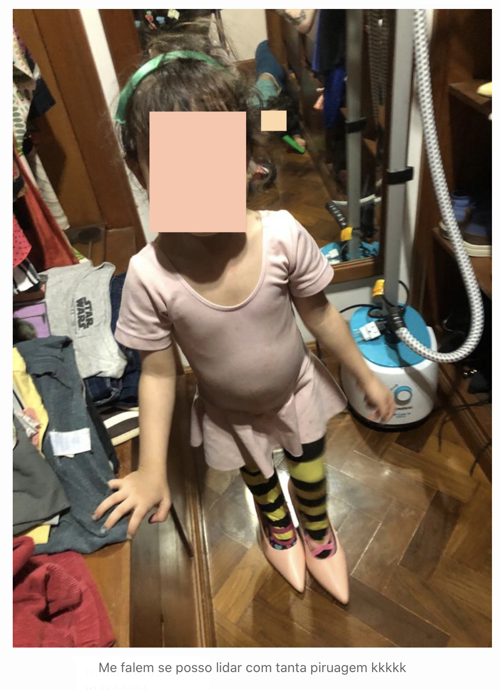

Outro dia estava conversando com amigas num grupo de WhatsApp e uma delas manda:

A filhota dela havia invadido o armário e feito uma bagunça 🙂

Uma delas comenta “Eu adorava fazer isso”. E a mãe “Eu também, por isso que nem reprimo”. Eu falei: “Eu também, mas só quando ficava sozinha em casa”. Várias risadas.

Na hora passou um filminho na mente, dos momentos de adrenalina que minha mãe saía para fazer algo na rua e eu sempre perguntava “15 min? 30min?” Pra saber quanto tempo teria de exploração...

Tinha até a técnica de esperar uns minutinhos pois volta e meia ela voltava em casa por ter esquecido algo 😂

E la ia eu explorar o armário dela, observando cada angulo de cada coisa que mexia pra deixar milimetricamente como tinha encontrado. Eu pensava que mesmo prestando essa atenção toda eu ainda poderia cometer deslizes, logo quanto mais detalhes melhor.

Acabei desenvolvendo um olhar detalhista que me ajuda bastante na minha profissão 🙆🏻‍♀️

  _= M =_
