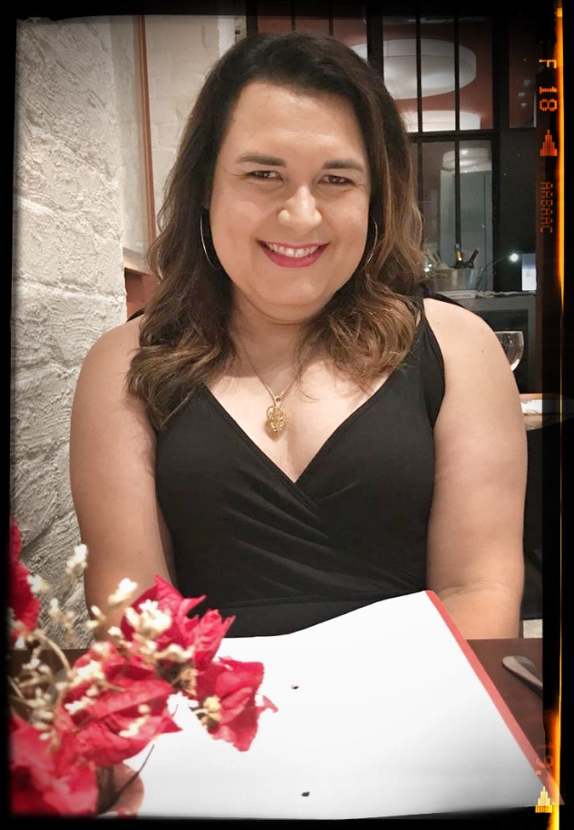

Poderia ter passado a maior parte da minha vida me escondendo de mim...

Poderia ter passado uma parte maior da minha vida me escondendo de você...

Poderia ter passado boa parte da minha vida procurando alguém a quem recorrer...

Poderia ter vivido uma vida que não era a minha, tentando atender às expectativas que eu imaginava serem suas...

Poderia ter machucado pessoas queridíssimas para mim, tentando ser algo que eu não era *e sem saber **o que** eu era...*

Se eu fosse trans seria muito difícil explicar para você, com palavras...

Que eu não "acordei um dia e resolvi virar menina” mas que eu sempre fui...

Que nem eu, nem ninguém “vira” alguma coisa. Isso não é uma doença contagiosa, nem algo que se aprende...

Que nossa relação não muda em nada, apenas a forma que você irá me tratar a partir de agora...

Que você não "tem que" nada, estamos todos aprendendo, começando por mim...

Se eu fosse trans e tivesse levado mais de 4 décadas de vida para expor isso para meus amigos e conhecidos, eu procuraria ter o preparo para perder algumas amizades e o afastamento de algumas pessoas...

Então se minha identidade de gênero é mais importante para você do que nossa amizade, quer dizer que nossa amizade nunca foi lá essas coisas mesmo...

Pois é, eu sou uma **mulher transgênero** e estou me sentindo bem para expor para o mundo...

E adoraria conversar com todos que quisessem saber mais a respeito, respeitosamente.

E nunca fui tão feliz quanto agora....

