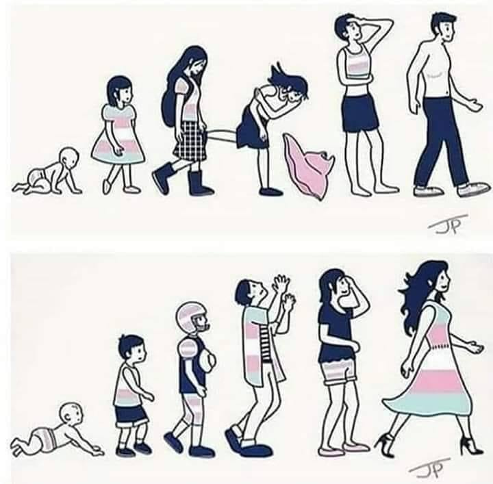

    "- Oi tudo bom?"
    "- Tudo bem e você?"
    "- Tudo ótimo. Fala de onde?"
    "- Botafogo e voce?"
    "- Flamengo"
    ...
    "- Vamos pro WhatsApp? Esse chat aqui é ruim"
    "- Claro, mas você já leu meu perfil?"
\*_block_\*

Esse diálogo acima resume bem a minha experiencia em aplicativos de relacionamento. Tipo 99% das vezes.

O que me fez refletir. Qual seria esse "medo" que os homens sentem quando descobrem que estão conversando com uma mulher transgênero a ponto de fugir sem dar satisfação, no meio de uma conversa que estava se desenvolvendo.

Tenho certeza de que com o tempo as pessoas vão se esclarecer mais, conhecer mais estórias como a minha, e vão entender que mulheres transgênero são pessoas que se sentem mulheres em um corpo "errado", logo qualquer característica que a remeta ao masculino causa um incômodo e tristeza (a tal [disforia de gênero](https://pt.wikipedia.org/wiki/Disforia_de_gênero)).

Porém além do "medo" da anatomia da moça (que como falei acima, ela não está nem um pouco a fim de utilizá-la) tem o fator psicológico. Como os aplicativos escondem o chat quando alguém te bloqueia só posso imaginar o que se passa na cabeça dessas pessoas:

"Poxa, bacana essa menina, _mas ela é homem_, então ela me _transformou em gay_". Na internet há varias discussões sobre a [fragilidade da sexualidade do homem hétero](https://www.google.com/search?q=fragilidade+sexualidade+homem+hetero), então não vou entrar nesse assunto. Acredito que os leitores habituais do meu blog se incomodaram quando escrevi "_mas ela é homem_" pois já sabem que _mulheres trans_ são **mulheres** antes de serem _trans_.

Também acredito que se lembrem que ninguém "vira" nada, como expliquei no meu [primeiro post](). Se você, rapaz, não sente atração pelo gênero masculino, você continua sendo hétero. Mas não vamos ficar discutindo semântica...

